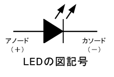

## ■Lesson3_LED

### ▼概要  
このレッスンでは、異なる値の抵抗を使用してLEDの輝度を変更する方法を学習します。

### ▼構成部品  
- Elegoo Uno R3 × 1  
- 830ポイント ブレッドボード × 1  
- 5mm 赤色LED × 1  
- 220Ω 抵抗 × 1  
- 1kΩ 抵抗 × 1  
- 10kΩ 抵抗 × 1  
- ジャンパワイヤ（オス-オス）× 2   

### ▼回路図  

### ▼スケッチコード
[コード_Lesson3_LED](Lesson3_LED.ino)  

### ▼注意事項  
- LEDには、アノードとカソードと呼ばれる極性がある。  
　つまりプラスとマイナスがあり、向きを間違えてつなぐと光らない。  
　**陽極【プラス側】・・・アノード（記号「A」）**  
　**陰極【マイナス側】・・・カソード（記号「K」）**  
    
    

- 抵抗器（resistor）には極性はない。  
  ただし、抵抗器のカラーコードが5本帯のため読み間違いに注意すること。

## ■配線の様子
下の写真はブレッドボードに回路を組んだ様子です。

## ■実行結果
LEDが光っている様子はこちらです。

### ▼工作していて気付いたこと  
- ブレッドボードに接続する際には、+と-に注意する（特に電源ボード、混乱を避けるため）  
- GNDは-、5Vは+  
- LEDのカソードはGNDと同じ-の列に接続する  
- 抵抗器のΩが大きいほど、LEDの明かりが弱くなる

### ▼感想  
- LEDの点灯は簡単だと思っていたが、接続の際に気を付ける事項（LEDの極性など）が多く、  
  実際に自分の手で触って作ることが大切だと思った。
  
### ▼参考にしたサイト  
- [LEDの極性について](https://www.my-craft.jp/html/aboutled/led_kyokusei.html)  
- [抵抗器のカラーコード](https://www.jarl.org/Japanese/7_Technical/lib1/teikou.htm)  
- [ブレッドボードの使い方](http://shop.sunhayato.co.jp/blogs/problem-solving/breadboard)
