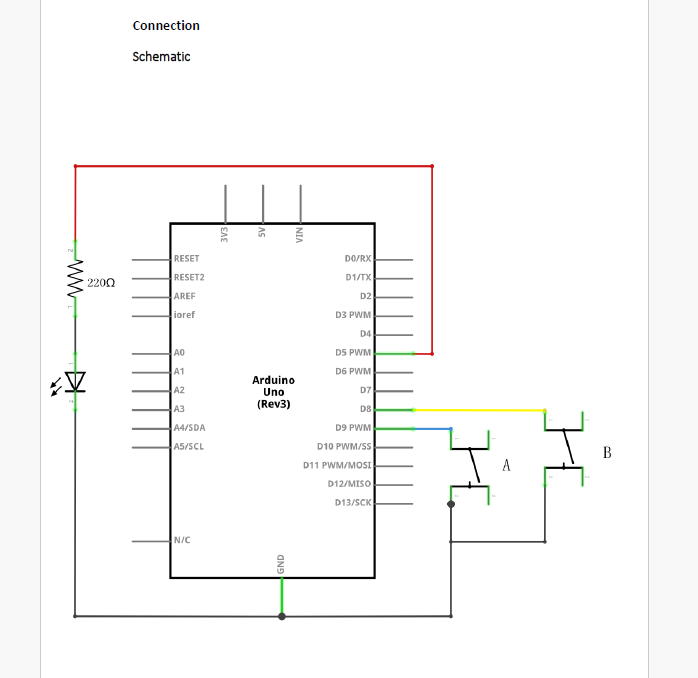
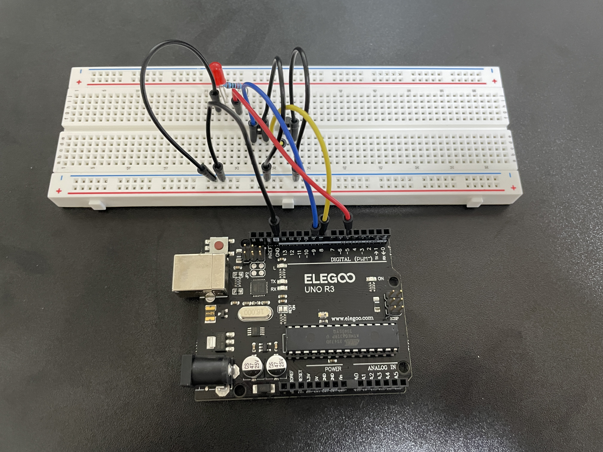
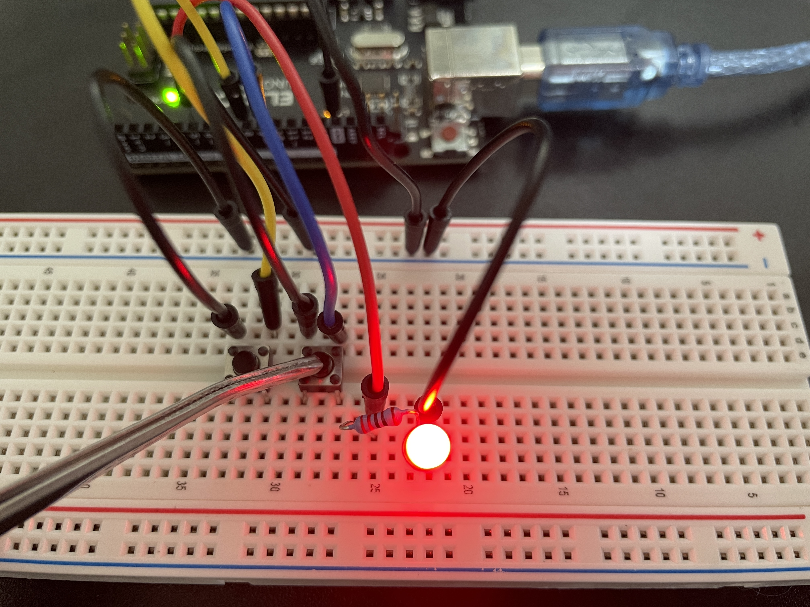

## ■ Lesson5_Digital_Inputs

### ▼ 概要  
このレッスンでは、プッシュボタンによるデジタル入力を用いて、LEDをオン/オフする方法を学びます。  
片方のボタンを押すとLEDが点灯し、もう片方のボタンを押すとLEDが消灯します。

### ▼ 必要な構成部品  
- Elegoo Uno R3 × 1  
- 830ポイント ブレッドボード × 1  
- 5mm 赤色LED × 1  
- 220Ω抵抗 × 1  
- プッシュスイッチ × 2  
- ジャンパワイヤ（オス-オス）× 7
  

### ▼ 回路図  

### ▼ スケッチコード  
[コード_Lesson5_Digital_Inputs.ino](Lesson5_Digital_Inputs.ino)

### ▼ 注意事項  
- プログラムでは `pinMode()` を `INPUT_PULLUP` に設定します。これは、ボタンが押されていない状態を `HIGH`、押されたときに `LOW` と判定するためです。
- 条件式に注意してください：  
　- 8ピンのスイッチが押される（LOW）と、LEDが消灯  
　- 9ピンのスイッチが押される（LOW）と、LEDが点灯  

※ 使用するプッシュスイッチには4つの端子がありますが、実際に電気的に接続されているのは2対のみです。たとえば、AとDが接続されており、BとCも内部でつながっています。

## ■ 配線の様子  

下の写真は、ブレッドボード上に組んだ回路の様子です。  

## ■ 実行結果  

右側のボタンを押すと、LEDが点灯しました。  

左側のボタンを押すと、LEDが消灯しました。  

### ▼ 工作していて気づいたこと  
- 今回のレッスンでは、LEDの点灯/消灯のきっかけがスイッチとなっており、これまでのようにマイコンから直接LEDを制御する構成とは異なっていました。
- たとえば、9ピンに接続されたスイッチが押されてLOWになると、5ピンから出力される信号によってLEDが点灯します。
- つまり、スイッチの状態が入力としてマイコンに伝わり、それをもとにマイコンがLEDを制御している構造だと理解しました。

### ▼ 感想  
- 今回の構成では、LEDの点灯/消灯がスイッチをきっかけにしてプログラムで制御されていることが新鮮でした。  
- 前回までのように、単純にLEDを点灯させるだけでなく、「入力→処理→出力」という流れを意識できました。  
- スイッチの状態をマイコンが読み取り、プログラムによってLEDの5ピン出力を管理しているという理解で合っていると思います。ただし、まだ完全な自信はありません。

### ▼ 参考にしたサイト  
- 特になし
